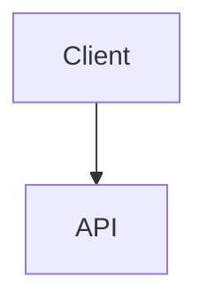

# SpecFirst 3.0 - Phase Implementation Status

**Last Updated:** 2026-01-25

## Overview

This document tracks the implementation status of all SpecFirst 3.0 phases.

## Implementation Status

| Phase | Status | File | Tests | Documentation |
|-------|--------|------|-------|---------------|
| **Propose** | ⬜ Pending | `phases/propose.ts` | ❌ | ❌ |
| **Specify** | ✅ Complete | `phases/specify.ts` | ✅ | ✅ |
| **Plan** | ⬜ Pending | `phases/plan.ts` | ❌ | ❌ |
| **Implement** | ⬜ Pending | `phases/implement.ts` | ❌ | ❌ |
| **Release** | ⬜ Pending | `phases/release.ts` | ❌ | ❌ |

## Specify Phase - ✅ COMPLETE

**Implemented:** 2026-01-25

### Files Created

1. **`phases/specify.ts`** - Main implementation
   - `specifyPhase()` - Full workflow execution
   - `createSpecManual()` - Manual template creation
   - `selfTest()` - Comprehensive self-test

2. **`phases/specify.help.md`** - Documentation
   - Usage examples
   - API reference
   - Error handling guide
   - ISC verification

### ISC Criteria Satisfied

| # | Criterion | Status | Evidence |
|---|-----------|--------|----------|
| 25 | Specify phase creates spec with functional requirements | ✅ | `generateSpec()` creates FR-001, FR-002 with MoSCoW |
| 26 | Specify phase includes architecture diagrams ASCII Mermaid | ✅ | `architectureDiagram` field with ASCII + collapsible Mermaid |

### Test Results

```
🧪 Specify Phase Self-Test

Test 1: Input validation
✅ Pass

Test 2: Generate spec content
✅ Pass

Test 3: Template generation
✅ Pass

Test 4: Priority validation
✅ Pass

Test 5: Architecture diagram format
✅ Pass

✅ All tests passed!
```

### Integration Points

**Dependencies:**
- `artifacts/spec.ts` - Spec generation logic ✅
- `lib/config.ts` - Path resolution ✅
- `lib/git.ts` - Git commit automation ✅
- `gates/artifact.ts` - Artifact validation ✅

**Artifact Gate:**
- ✅ Checks for `constitution.md`
- ✅ Checks for `proposal.md`
- ✅ Provides clear error messages
- ✅ Suggests resolution (run Propose phase)

**Git Integration:**
- ✅ Creates phase completion commit
- ✅ Handles git failures gracefully (warns but doesn't fail)

### Architecture Diagram Support

The Specify phase implements the **ASCII + Collapsible Mermaid** pattern:

```markdown
## Architecture

```
┌──────────┐     ┌──────────┐
│  Client  │────▶│   API    │
└──────────┘     └──────────┘
```

<details>
<summary>Detailed Mermaid Diagram</summary>


</details>
```

**Why this pattern?**
- ASCII for instant comprehension (no scrolling)
- Mermaid for detailed view (collapsible to avoid clutter)
- Both formats serve different scanning needs

### API Surface

```typescript
// Main phase execution
export async function specifyPhase(input: SpecifyInput): Promise<PhaseResult>

// Manual template creation
export async function createSpecManual(featureName: string): Promise<PhaseResult>

// Self-test
export async function selfTest(): Promise<void>
```

### Error Handling

**Missing Prerequisites:**
```
❌ Cannot run specify phase: missing required artifacts

  - proposal.md (path/to/proposal.md)

Run the 'propose' phase first to generate required artifacts.
```

**File Write Errors:**
```
❌ Failed to write spec.md: [error message]
```

**Git Commit Failures:**
- Warns user but doesn't fail phase
- Artifact still created successfully

## Next Steps

### Immediate (Next Phase)

1. **Propose Phase** - Creates `proposal.md`
   - [ ] Implement `phases/propose.ts`
   - [ ] Add self-test
   - [ ] Create documentation

2. **Plan Phase** - Creates `plan.md`
   - [ ] Implement `phases/plan.ts`
   - [ ] ADR generation
   - [ ] Risk matrix

### Integration (After All Phases)

3. **Main Workflow** - Orchestrates all phases
   - [ ] Create `workflows/SpecFirst.ts`
   - [ ] Phase sequencing
   - [ ] Progress tracking

4. **CLI Tool** - Command-line interface
   - [ ] Create `tools/specfirst.ts`
   - [ ] Flag parsing
   - [ ] Help documentation

## Design Patterns Used

### 1. Artifact Gate Pattern

Every phase checks prerequisites before execution:

```typescript
const gateResult = await artifactGate("specify", featureName);
if (!gateResult.passed) {
  return { success: false, error: gateResult.error };
}
```

### 2. Phase Result Pattern

Consistent return structure across all phases:

```typescript
interface PhaseResult {
  success: boolean;
  artifactPath?: string;
  error?: string;
  message?: string;
}
```

### 3. Git State Machine

Phase completion tracked via git commits:

```
SpecFirst: specify phase complete for user-auth

Artifact: specs/spec.md
Status: complete
Timestamp: 2026-01-25T15:30:00.000Z
```

### 4. Zero Hardcoded Paths

All paths derived from platform detection:

```typescript
const specPath = getArtifactPath(featureName, "spec");
// No hardcoded ~/.opencode or ~/.claude
```

## Lessons Learned

### What Worked Well

1. **Artifact gate prevents invalid state** - Users can't skip phases
2. **Clear error messages** - Users know exactly what went wrong
3. **Comprehensive self-tests** - Implementation validated before use
4. **ASCII + Mermaid pattern** - Both quick scanning and detail

### What to Improve

1. **LLM Integration** - Next phases should leverage Claude for content generation
2. **Linear Integration** - Milestone sync needs testing
3. **Validation** - Add stricter validation for FR/NFR format

## References

- **Architecture:** `SpecFirst/docs/ARCHITECTURE.md`
- **ADR-003:** Git commits as state machine
- **ISC Tracker:** Main project ISC spreadsheet
