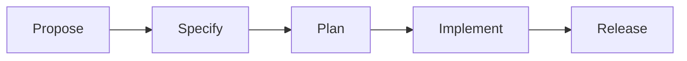

# SpecFirst 3.0 - Phase Implementations

**Phases orchestrate the SpecFirst workflow from proposal to release.**

---

## Overview

Each phase represents a stage in the SpecFirst methodology:

```
propose → specify → plan → implement → release
```

Phases are TypeScript modules that:
1. Run quality gates (prerequisite, ISC compliance, etc.)
2. Generate artifacts (proposal.md, spec.md, etc.)
3. Create git commits marking phase completion
4. Return structured results

---

## Phase Structure

All phases follow this pattern:

```typescript
export interface PhaseInput {
  featureName: string;
  // Phase-specific fields
}

export interface PhaseResult {
  success: boolean;
  artifactPath?: string;
  error?: string;
}

export async function phaseFunction(input: PhaseInput): Promise<PhaseResult> {
  // 1. Run gates
  // 2. Generate artifact
  // 3. Create commit
  // 4. Return result
}
```

---

## Available Phases

### ✅ Propose Phase (`propose.ts`)

**Status:** Implemented and tested
**ISC Coverage:** #23, #24

Creates `proposal.md` with:
- Problem statement
- Solution approaches (Option A, B, C...)
- Recommended approach with rationale
- Anti-patterns to avoid
- Open questions

**Functions:**
- `proposePhase(input)` - Full proposal generation
- `createProposalInteractive(featureName)` - Template generation

**Usage:**
```typescript
import { proposePhase } from "./phases/propose";

const result = await proposePhase({
  featureName: "contact-enrichment",
  problemStatement: "Need to enrich contact data from multiple sources",
  solutionApproaches: [
    {
      name: "Sequential API calls",
      description: "Call each API in sequence",
      pros: ["Simple", "Easy to debug"],
      cons: ["Slow", "High latency"]
    }
  ],
  recommendedApproach: "Use sequential approach for MVP",
  antiPatterns: ["Don't cache without TTL"],
  openQuestions: ["How will this scale to 10k contacts?"]
});

if (result.success) {
  console.log(`Proposal created: ${result.artifactPath}`);
}
```

**Git Commit Format:**
```
SpecFirst: propose phase complete for {feature-name}

Artifact: {path-to-proposal.md}
Status: complete
Timestamp: {ISO-8601}
```

---

### 🚧 Specify Phase (`specify.ts`)

**Status:** Not yet implemented
**ISC Coverage:** #25, #26, #27, #28

Will create `spec.md` with:
- Feature requirements (ISC criteria - 8 words each)
- User stories
- API contracts
- Data models
- Integration points

---

### ✅ Plan Phase (`plan.ts`)

**Status:** Implemented and tested
**ISC Coverage:** #27, #28

Creates `plan.md` with:
- Architecture Decision Records (ADRs)
- Implementation phases (numbered, with risks)
- Testing strategy
- Risk matrix
- Dependencies
- Rollback procedures

**Functions:**
- `planPhase(input)` - Full plan generation
- `selfTest()` - Validation tests

**Usage:**
```typescript
import { planPhase } from "./phases/plan";

const result = await planPhase({
  featureName: "user-auth",
  executiveSummary: "JWT-based authentication with refresh tokens",
  adrs: [
    {
      id: "ADR-001",
      title: "Use JWT for authentication",
      status: "accepted",
      date: "2026-01-25",
      context: "Need stateless auth",
      decision: "Use JWT with RS256",
      rationale: "Industry standard, scalable",
      alternatives: [{ name: "Sessions", reason: "Requires state" }],
      consequences: ["Need key rotation", "Token overhead"]
    }
  ],
  implementationPhases: [
    {
      number: 1,
      name: "Core Auth",
      objective: "JWT generation and validation",
      deliverables: ["JWT service", "Auth middleware"],
      acceptanceCriteria: ["Tokens validate correctly"],
      estimatedEffort: "3 days",
      dependencies: [],
      risks: ["Clock skew", "Key rotation during sessions"] // Required!
    }
  ],
  testingStrategy: {
    unitTests: "Jest with 80% coverage",
    integrationTests: "Supertest for auth flows",
    e2eTests: "Playwright for login/logout",
    performanceTests: "k6 for token validation",
    coverageTarget: "80%"
  },
  risks: [
    {
      id: "R-001",
      description: "Private key exposure",
      probability: "low",
      impact: "high",
      mitigation: "Store in encrypted vault"
    }
  ],
  dependencies: [
    {
      name: "jsonwebtoken",
      type: "external",
      risk: "low",
      mitigation: "Pin version, audit regularly"
    }
  ],
  rollbackProcedures: "Feature flag JWT, keep session auth"
});
```

**Git Commit Format:**
```
SpecFirst: plan phase complete for {feature-name}

Artifact: {path-to-plan.md}
Status: complete
Timestamp: {ISO-8601}
```

---

### ✅ Implement Phase (`implement.ts`)

**Status:** Implemented and tested
**ISC Coverage:** #29, #30

Creates `tasks.md` in ISC format from `plan.md`:
- Extracts acceptance criteria from implementation phases
- Converts to exactly 8-word ISC criteria
- Generates anti-criteria from risk matrix
- Returns handoff message for Algorithm to load ISC tracker

**Functions:**
- `implementPhase(input)` - Full ISC generation
- `extractCriteriaFromPlan(featureName)` - Parse plan.md
- `convertTo8Words(text)` - Ensure 8-word format
- `selfTest()` - Validation tests

**Usage:**
```typescript
import { implementPhase, extractCriteriaFromPlan } from "./phases/implement";

// Option 1: Provide criteria directly
const result = await implementPhase({
  featureName: "user-auth",
  ideal: "User authentication complete with verified JWT tokens.",
  criteria: [
    {
      id: 1,
      criterion: "User login endpoint responds with valid JWT",
      status: "⬜",
      phase: "Phase 1: Core Auth"
    }
  ],
  antiCriteria: [
    {
      id: "A1",
      criterion: "No credentials exposed in git history",
      status: "👀"
    }
  ]
});

// Option 2: Extract from plan.md automatically
const input = await extractCriteriaFromPlan("user-auth");
const result = await implementPhase(input);

if (result.success) {
  console.log(result.handoffMessage);
  // ✅ SpecFirst Implement phase complete for user-auth
  // 📋 Generated 6 ISC criteria in tasks.md
  // 🎯 Algorithm: Load ISC from /path/to/tasks.md
}
```

**CLI Usage:**
```bash
# Extract from plan.md and generate tasks.md
bun .opencode/skills/SpecFirst/phases/implement.ts user-auth

# Run self-test
bun .opencode/skills/SpecFirst/phases/implement.ts --test
```

**Git Commit Format:**
```
SpecFirst: implement phase complete for {feature-name}

Artifact: {path-to-tasks.md}
Status: complete
Timestamp: {ISO-8601}
```

**Handoff Message:**
```
✅ SpecFirst Implement phase complete for {feature}
📋 Generated {N} ISC criteria in tasks.md
🎯 Algorithm: Load ISC from {path}

Next steps:
1. Algorithm reads tasks.md and loads ISC tracker
2. Work through criteria sequentially or in parallel
3. Update status as each criterion is verified
4. Run release phase when all criteria ✅
```

---

### 🚧 Release Phase (`release.ts`)

**Status:** Not yet implemented
**ISC Coverage:** #36, #37

Will handle:
- Final validation
- Deployment
- Documentation updates
- Release notes generation

---

## Phase Dependencies

Phases must execute in order:



Each phase checks for the previous phase's completion via git commits.

---

## Testing Phases

All phase modules include self-tests:

```bash
# Set environment to OpenCode
export OPENCODE_DIR=/path/to/.opencode

# Run self-test
bun phases/propose.ts

# Run with specific feature
bun phases/propose.ts my-feature-name
```

Self-tests verify:
- Prerequisite gate validation
- Artifact generation
- ISC criteria compliance
- Git commit creation

---

## Error Handling

Phases return structured errors:

```typescript
// Prerequisite failure
{
  success: false,
  error: "Constitution file missing: /path/to/CONSTITUTION.md",
}

// Artifact generation failure
{
  success: false,
  error: "Template validation failed: Missing required section"
}

// Git commit failure
{
  success: false,
  artifactPath: "/path/to/proposal.md", // File created
  error: "Git commit failed: Not a repository"
}
```

---

## Implementation Checklist

When implementing a new phase:

- [ ] Create phase module in `phases/{name}.ts`
- [ ] Define `PhaseInput` interface
- [ ] Implement gate validation
- [ ] Generate artifact using `artifacts/{name}.ts`
- [ ] Create git commit via `lib/git.ts`
- [ ] Return `PhaseResult`
- [ ] Add self-test block
- [ ] Update this README
- [ ] Add ISC criteria coverage to main spec

---

## Related Documentation

- **Artifacts:** `../artifacts/README.md` - Artifact generation
- **Gates:** `../gates/README.md` - Quality gate validation
- **Config:** `../lib/config.ts` - Path resolution
- **Git:** `../lib/git.ts` - Commit automation
- **Main Spec:** `../docs/spec.md` - Full SpecFirst specification

---

*Last updated: 2026-01-25*
*SpecFirst 3.0*
